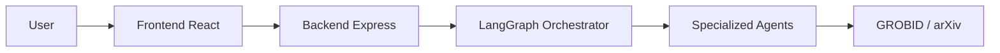

# RefHunters - Agentic Research Assistant

An intelligent multi-agent system for analyzing scientific research papers with automatic citation extraction, paper retrieval, and AI-powered Q&A capabilities.

  

---

## 🏗️ High-Level Architecture



RefHunters coordinates specialized AI agents (A0, A1, A2) to parse research papers, find relevant external references, and synthesize comprehensive, cited answers.

---

## 🚀 Quick Start (Production)

### 1. Prerequisites
- **Node.js** (v18+)
- **Docker** (for GROBID)
- **Redis**
- **OpenAI API Key**

### 2. Start Services
```bash
# 1. Start GROBID
docker run -d -p 8070:8070 lfoppiano/grobid:0.7.1

# 2. Start Redis
sudo systemctl start redis-server

# 3. Launch Backend
cd RefHunters-Backend && npm install && npx tsx src/server.ts

# 4. Launch Frontend
cd RefHunters-Frontend && npm install && npm run dev
```
*Frontend: http://localhost:5173 | Backend: http://localhost:3001*

---

## 📁 Repository Structure

- **[RefHunters-Backend](./RefHunters-Backend)**: LangGraph orchestrator, GROBID integration, and agent logic.
- **[RefHunters-Frontend](./RefHunters-Frontend)**: React chat interface and citation-aware PDF viewer.

---

## 🔌 Core API

| Method | Endpoint | Purpose |
|--------|----------|---------|
| `POST` | `/api/upload` | Upload PDF & start session |
| `POST` | `/api/answer` | Primary research Q&A |

---

## 📚 Documentation

- **[Service Management Guide](./SERVICE_MANAGEMENT.md)**: Simple Start/Stop/Check commands.
- **[System Architecture](./RefHunters-Backend/SYSTEM_ARCHITECTURE.md)**: Deep dive into agent logic.

---

**Maintained by:** RefHunters Team  
**Last Updated:** January 4, 2026