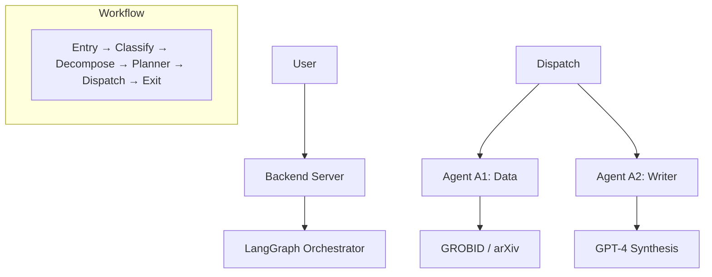

# RefHunters - System Architecture

**Version:** 3.0 | **Last Updated:** Jan 4, 2026

RefHunters uses a multi-agent workflow orchestrated by **LangGraph** to analyze research papers.

---

## 🏗️ Architecture Overview

---

## 🤖 Agent Profiles

### Agent A0 (Controller)
*Distributed across modular nodes in `src/nodes/`.*
- **Brain**: Classifies query type (QA/Summary), complexity, and extracts keywords.
- **Decomposer**: Splits complex global queries into atomic sub-questions.
- **Planner**: Builds a list of `retrieve` and `reason` tasks.

### Agent A1 (Data & Evidence)
*Handles information acquisition in `a1.ts`.*
- **Tools**:GROBID PDF parsing, arXiv search, PDF download.
- **Workflow**: Extracts citations from main paper → Searches arXiv for full references → Chunks PDFs into evidence.
- **Iteration**: Stops once valid reference PDFs are acquired (max 15 iterations).

### Agent A2 (Answer Writer)
*Handles final synthesis in `a2.ts`.*
- **Tools**: Evidence analysis and response synthesis.
- **Rule**: ONLY use provided evidence chunks.
- **Output**: Generates formatted markdown answers with inline citations `[0]`, `[1]`.

---

## ⚙️ Core Modules

### 1. LangGraph Nodes (`src/nodes/`)
Decoupled logic for each stage of the workflow (Entry, Classify, etc.).

### 2. Utilities (`src/utils/`)
- **TaskBuilder**: Standardizes task objects for A1/A2.
- **TaskExecutor**: Handles agent loops and tool execution.
- **EvidenceAggregator**: Consolidates results from multiple sub-queries into a unified vector store.
- **SessionVectorStore**: Local semantic search with cosine similarity and main-paper boosting.

---

## 🔄 Technical Data Flow

1.  **Entry**: Session state is restored from **Redis**.
2.  **Logic**: Query is categorized and planned.
3.  **Discovery (A1)**: Agent navigates the citation network to find source PDFs.
4.  **Ranking**: `EvidenceAggregator` ranks all discovered chunks by semantic relevance.
5.  **Synthesis (A2)**: Agent writes the answer based on the high-ranking evidence.
6.  **Exit**: Results and conversation history are saved to Redis.

---

## 🔧 Workflow Configuration

Constants are centralized in `workflow-config.ts`:
- `maxA1Iterations`: 15
- `maxA2Iterations`: 10
- `topN` (Bibliography Filtering):
    - `default`: 12 (Citations checked for standard Q&A)
    - `summary`: 2 (Citations checked in summary mode)
- `topK` (Content Chunks):
    - `default`: 8 (Chunks kept per reference paper)
    - `semanticSearch`: 35 (Total chunks sent to Writer)

---

**Maintained by:** RefHunters Team  
**Architecture Source**: `RefHunters-Backend/src/index.ts`
